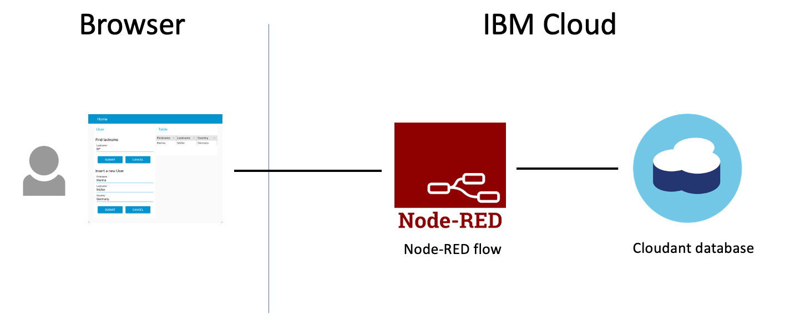
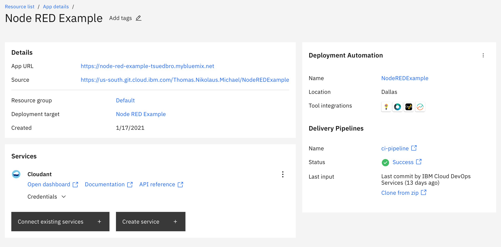

# Introduction

This [Node-RED](https://nodered.org/) flow is for **absolute beginners** with minimal `javascript` programming knowledge, who going to participate in Hackathons.
The documentation guides you to following main topics in Node-RED:

How to ...

* ... save data in database?
* ... search for entries in the database?
* ... display data in a UI?

The flowing gif shows the usage of final flow implementation in Node-RED.

### Motivation

The background for that example project is, when I support Hackathons I notice there's often the leak programming knowledge and build UIs. In this case is Node-RED a perfect starting point to realize a prototype at the hackathon.
The dashboard of Node-RED is awesome way to build a UI, but there was a out of the box Node missing to simply to add tables. Now I found that very useful Node that’s create a table inside a Node-RED dashboard.

That’s motivated me to create this example project, which provides an example a to build a simple application from screech, which contains the main functionalities insert data, display data in a table and search for values.

### Estimated time and level

|  Time | Level  |
| - | - |
| one hour | beginners |

### Objectives

You should be able to use your Node-RED instance on IBM Cloud to

* ... save data in a [Cloudant database](https://cloud.ibm.com/docs/Cloudant?topic=Cloudant-databases) within you Node-RED installation on IBM Cloud
* ... search for data entries using [Cloudant database query](https://cloud.ibm.com/docs/Cloudant?topic=Cloudant-query)
* ... display data in a UI using [Node-RED dashboard](https://flows.nodered.org/node/node-red-dashboard) and [Node-RED UI Table](https://flows.nodered.org/node/node-red-node-ui-table)

### Architecture

The following diagram shows the simplfied architecture of the example Node-RED application. 

### Prerequisites

You should have a ...

* ... free [IBM Cloud Lite Account](https://cloud.ibm.com/docs/overview?topic=overview-quickstart_lite)
* ... running Node-RED instance on IBM Cloud created with a pre-configured Node-RED App.

To setup the pre-configured Node-RED App just follow the steps in the video:

### Additional resources

* [Setup Node-RED on IBM Cloud](https://suedbroecker.net/2020/03/09/a-short-introduction-of-the-node-red-starter-kit-on-ibm-cloud-for-hackathons/)
* [Handle CORS in your Node-RED instance on IBM Cloud](https://suedbroecker.net/2019/03/13/cors-and-node-red-using-a-simple-forward-server/)
* [REST endpoints, authentication to external API, extract data from API, customize data and CRUD](https://suedbroecker.net/2020/03/26/a-node-red-twitter-follower-flow/)
