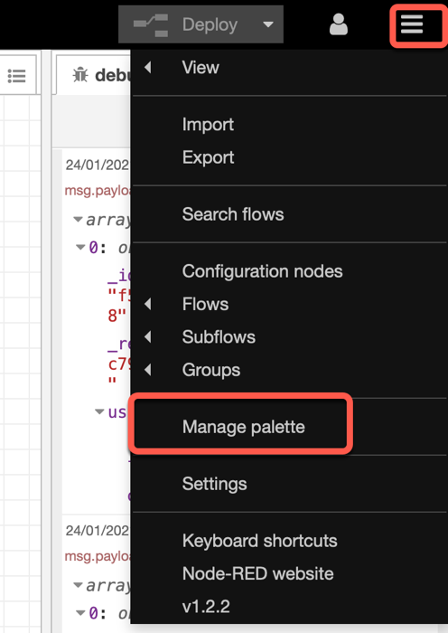

# Install dashboard and table

The much faster way to setup the flow is just to import the and configure the nodes, if needed. To ensure that we won't have missing node types in our Node-RED instance, we need to install the [Node-RED dashboard](https://flows.nodered.org/node/node-red-dashboard) and [Node-RED UI Table](https://flows.nodered.org/node/node-red-node-ui-table).

### Step 1: Install the [Node-RED dashboard](https://flows.nodered.org/node/node-red-dashboard) and [Node-RED UI Table](https://flows.nodered.org/node/node-red-node-ui-table)

* Open `Manage palette`

* Select the `install` tab, insert `node-red-dashboard` and press `install`
  Repeat it for the `node-red-node-ui-table`.

