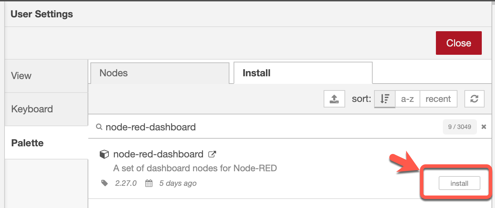
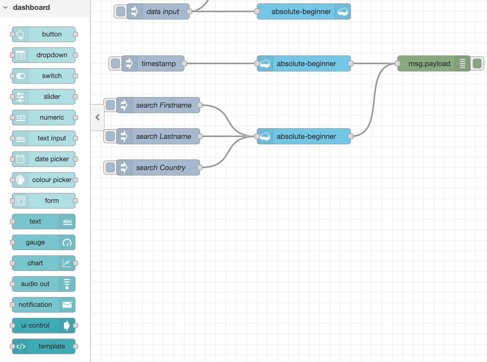

# Install dashboard and table

### Step 1: Install the [Node-RED dashboard](https://flows.nodered.org/node/node-red-dashboard) and [Node-RED UI Table](https://flows.nodered.org/node/node-red-node-ui-table)

* Open `Manage palette`

* Select the `install` tab, insert `node-red-dashboard` and press install

