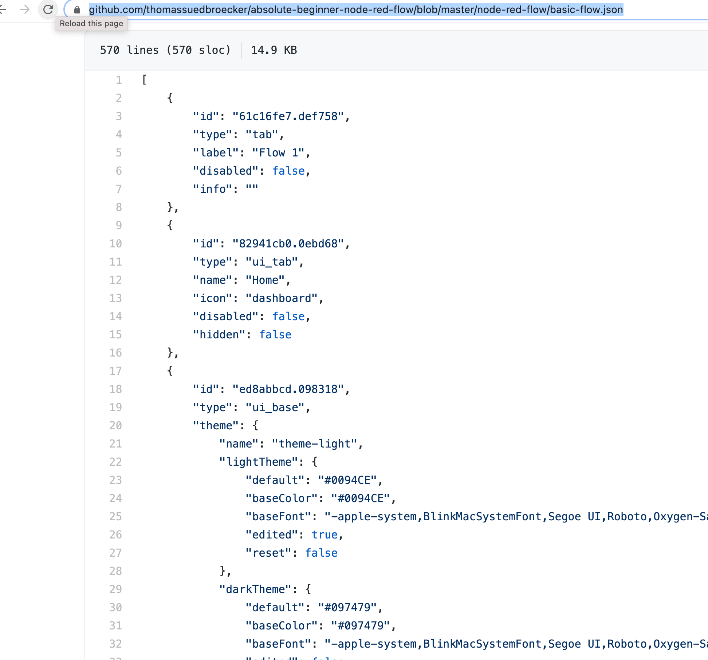
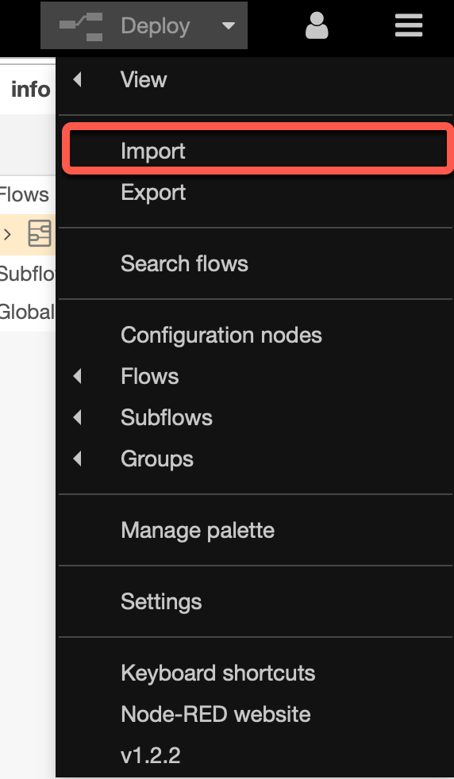
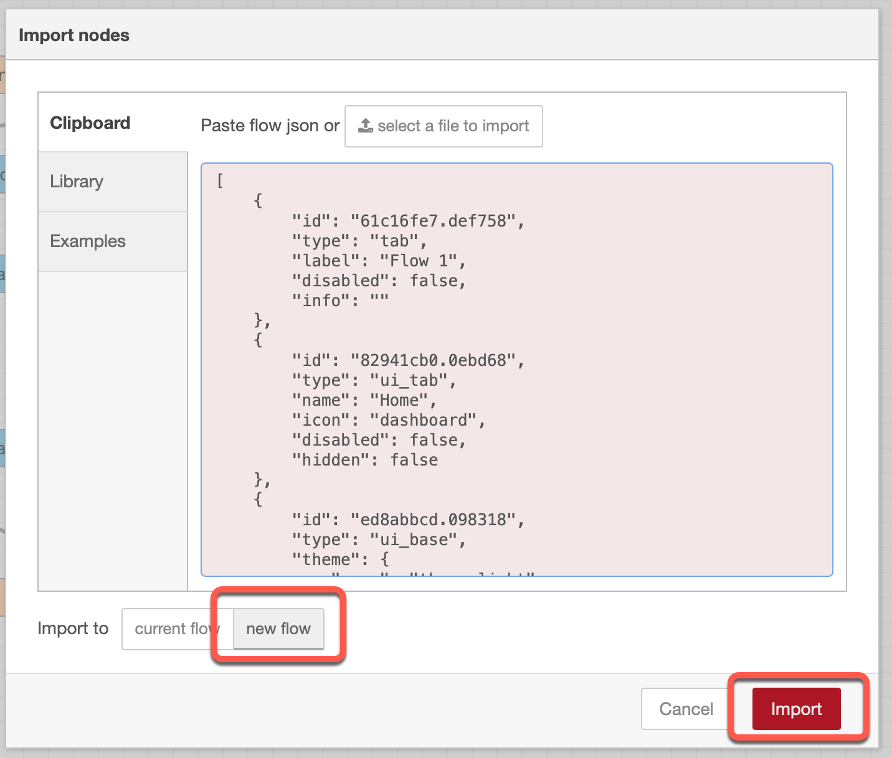

# Import existing Node-RED flow

### Step 1: Copy the content of the file [node-red-flow/basic-flow-flow.json](https://github.com/thomassuedbroecker/absolute-beginner-node-red-flow/blob/master/node-red-flow/basic-flow.json) in the GitHub repository.

### Step 2: Select `Import` in Node-RED

### Step 3: Past the copied content and press `Import`

