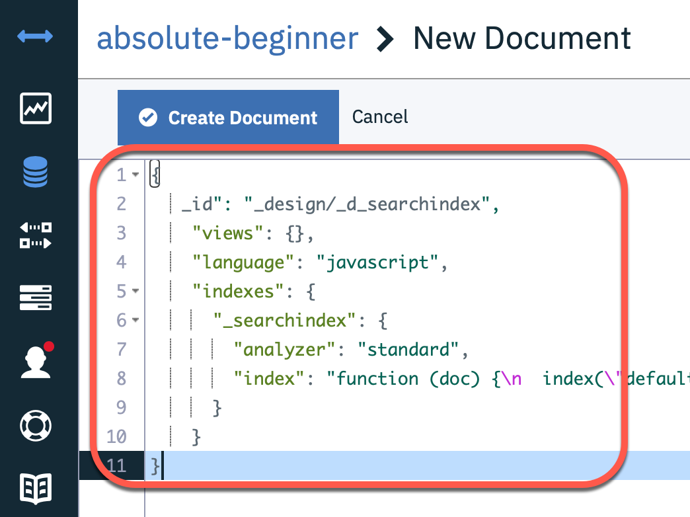

# Configure a search index

We need to create a design document to define a [search index](https://cloud.ibm.com/docs/Cloudant?topic=Cloudant-query) we will later use our queries.

* theFirstname
* theLastname
* theCountry

Example usage of a query `theLastname:S*` later:


### Step 1: Open the Cloudant the created database `absolute-beginner`


### Step 2: Create a new design document


### Step 3: Insert following JSON to create the needed design document

```json
{
  "_id": "_design/_d_searchindex",
  "views": {},
  "language": "javascript",
  "indexes": {
      "_searchindex": {
        "analyzer": "standard",
        "index": "function (doc) {\n  index(\"default\", doc._id);\n\n  if(doc.user.firstname){\n    index(\"theFirstname\", doc.user.firstname, {\"store\": true, \"facet\":true});\n  }\n  if(doc.user.lastname){\n    index(\"theLastname\", doc.user.lastname, {\"store\": true, \"facet\":true });\n  }\n  if(doc.user.country){\n    index(\"theCountry\", doc.user.country, {\"store\": true, \"facet\":true});\n  }\n}"
    }
  }
}
```
The image shows the new design document. 

