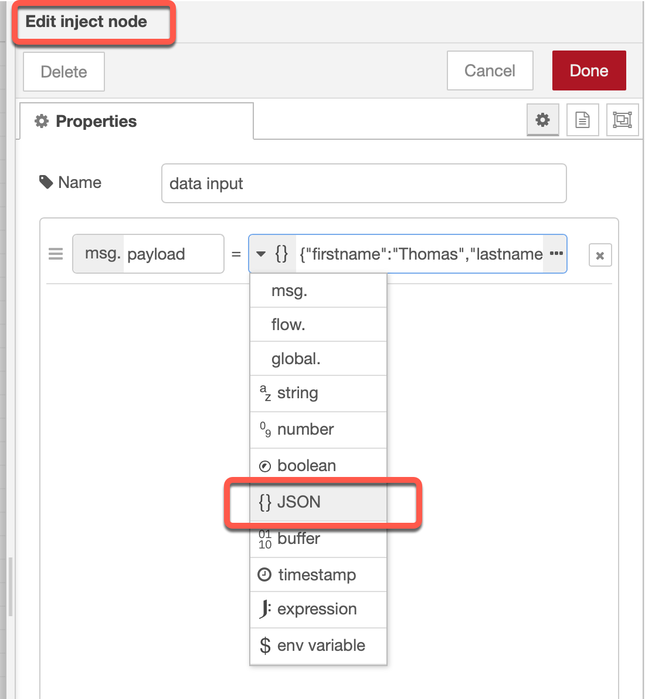
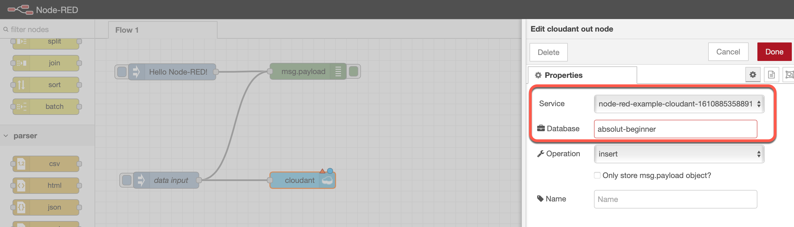
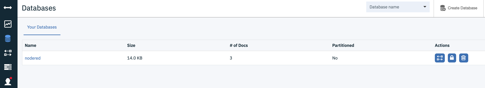
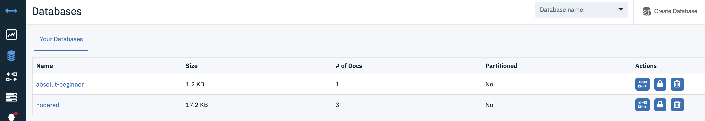

### Step 1: Configure the inject node to create JSON values




### Step 2: Insert into the inject node following data

```json
{ "user": {
    "firstname": "Thomas",
    "lastname": "Suedbroecker",
    "country": "Germany"
  }
}
```

### Step 3: Add a [Cloudant Node](https://flows.nodered.org/node/node-red-node-cf-cloudant)  and give the database the name: `absolute beginner`



### Step 4: Verify in your existing Cloudant service instance there is no database with the name `absolute beginner`



### Step 5: Press `data input` and verify in your existing Cloudant service now you can see the database `absolute beginner` with one entry 



### Step 6: Press deploy

