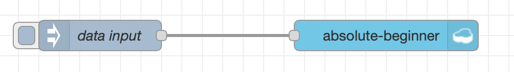
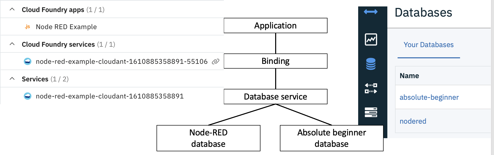
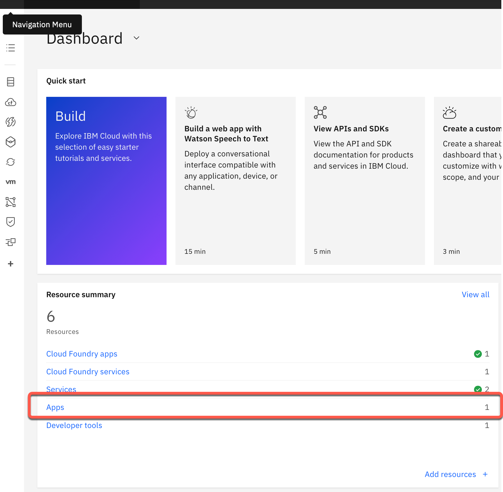
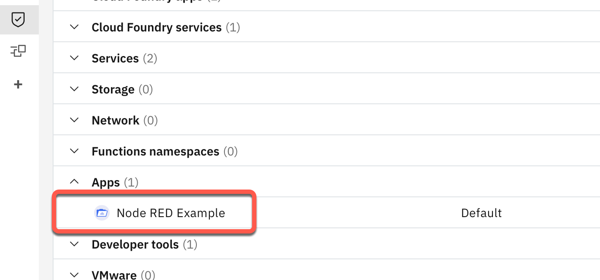
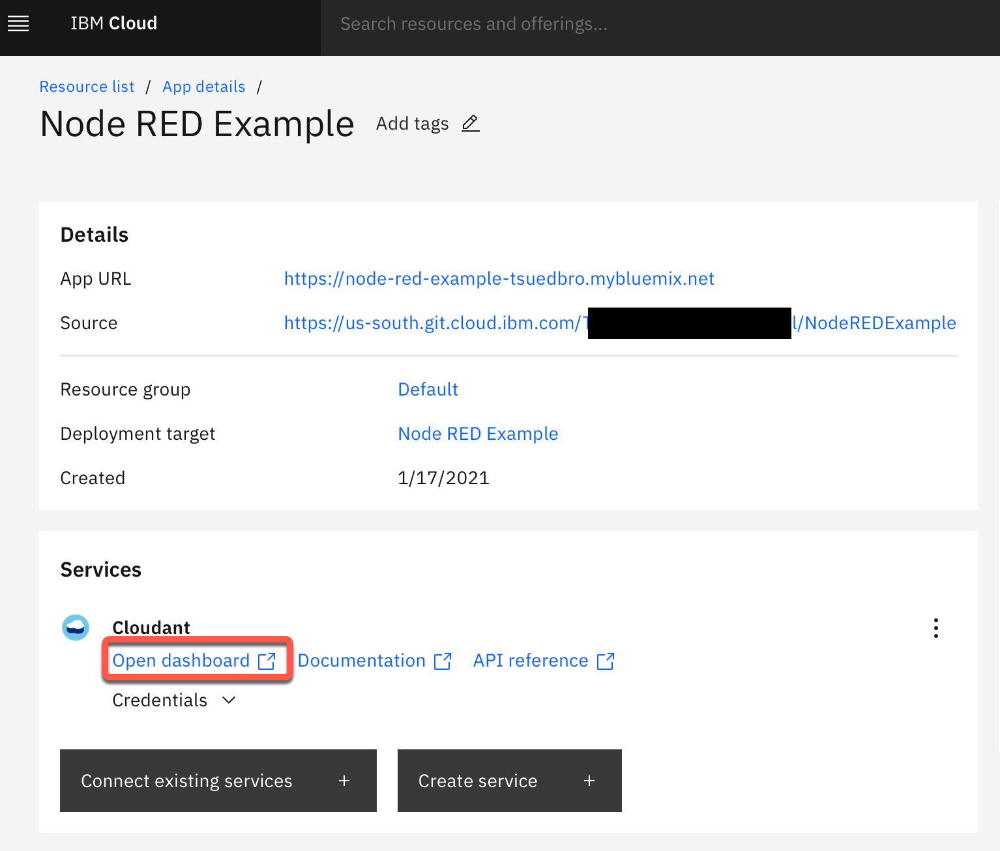
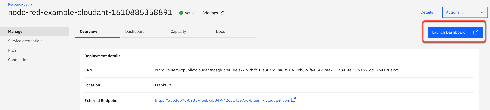
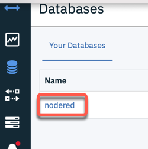
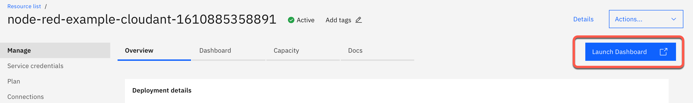

# Create data entries [YouTube (2:40)](https://youtu.be/qtOmufIjafE?t=154%20%E2%80%8B)

In this part we create an `inject` and a `cloudant out` node.



> **Background**: 
> In our situation we will use Node-RED on IBM Cloud with and Cloudant service instance, which contains a database to save the flows and more for our Node-RED instance. We use Cloud Foundry as our runtime for the Node-RED instance and with the existing Cloudant service binding, we easily can reuse our existing Cloudant service to create an `absolute beginner database` with a `cloudant out` node.

The image below shows the dependencies of `application`, `binding` and `database service`.




### Step 1: Configure the `inject` node to create a JSON value


### Step 2: Insert into the `inject node` following JSON

```json
{ "user": {
    "firstname": "Thomas",
    "lastname": "Suedbroecker",
    "country": "Germany"
  }
}
```
### Step 3: Open a new browser tap and login to your IBM Cloud account

### Step 4: In the dashboard select `App



### Step 5: Now press on your Node-RED App you created in the last video



### Step 6: Select in the App `Cloudant->Open Dashboard`



### Step 6: In the Cloudant database service press `Launch Dashboard`



### Step 7: Now you can see the existing database `nodered`

Later we will find here our `absolute-beginner` database



### Step 8: Add a [cloudant out](https://flows.nodered.org/node/node-red-node-cf-cloudant) node and give the database the name: `absolute beginner`


### Step 9: In the `cloudant in` node, verify you have selected `Only store msg.payload object?`


### Step 10: Select `Open dashboard` for your Cloudant service in our existing Node-RED app


### Step 11: Now press `Launch dashboard`



### Step 12: Verify in your existing Cloudant service instance, that you don't have a `absolute beginner` database


### Step 13: Press `data input` and verify in your existing Cloudant service was created a new database called `absolute beginner`


### Step 14: Press deploy

