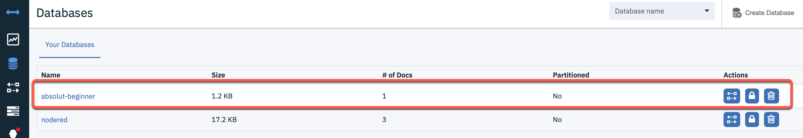

# Create data entries

In this part we create an `inject node` and a `cloudant out` node.


> **Background**: 
> In our situation we use Node-RED on IBM Cloud with and Cloudant service instance, which contains a database to save the flows and more for our Node-RED instance. We use Cloud Foundry as runtime for Node-RED instance and with existing Cloudant service binding, we easly can resue existing Cloudant service to create our `absolute beginner database` by using a `cloudant out` node.

The image below shows the dependencies with two screens shots.


### Step 1: Configure the `inject node` to create a JSON value


### Step 2: Insert into the `inject node` following JSON

```json
{ "user": {
    "firstname": "Thomas",
    "lastname": "Suedbroecker",
    "country": "Germany"
  }
}
```

### Step 3: Add a `[Cloudant Node](https://flows.nodered.org/node/node-red-node-cf-cloudant)`  and give the database the name: `absolute beginner`


### Step 4: In the `cloudant in` verify you have selected 


### Step 5: Verify in your existing Cloudant service instance there is no database with the name `absolute beginner`


### Step 5: Press `data input` and verify in your existing Cloudant service, now you can see the database `absolute beginner` with one entry 



### Step 6: Press deploy

