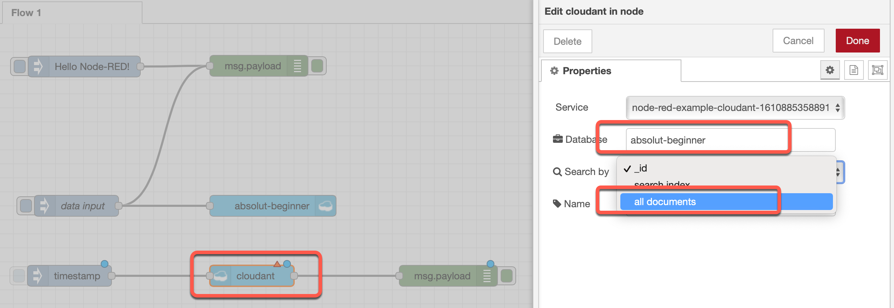
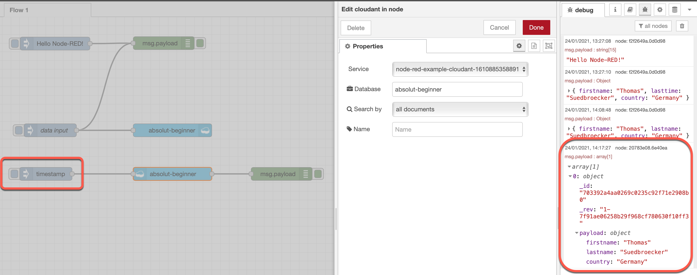

# Get data

### Step 1: Add a `inject node`, `cloudant in` and a `debug node` to the flow

### Step 2: Wire the nodes and configure the `cloudant in` node

* Database: `absolut-beginner`
* Search by: `all documents`

### Step 3: Press the newly created inject node and watch the output in the debug tab

### Step 4: Press deploy