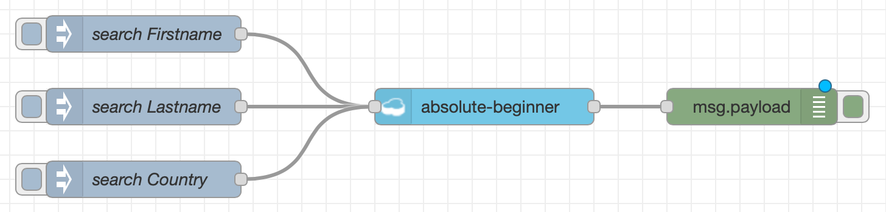
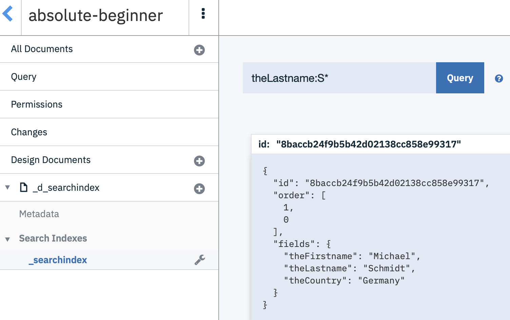
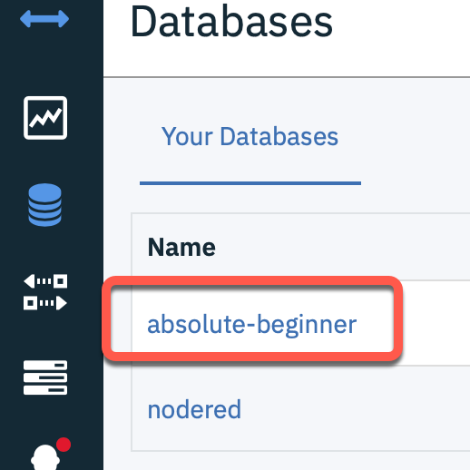
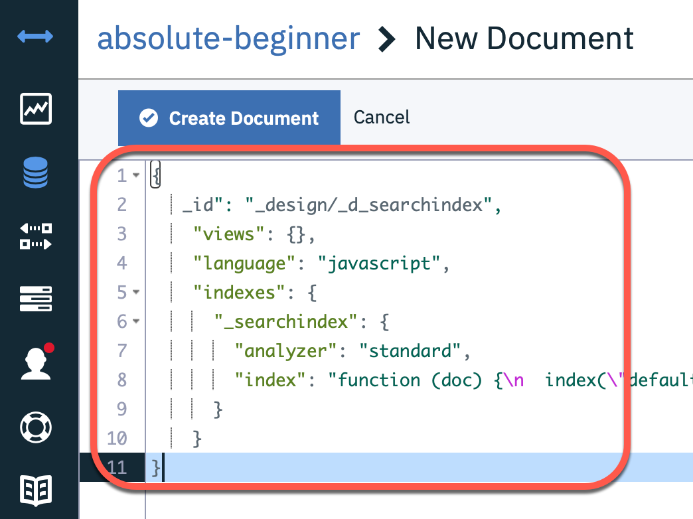
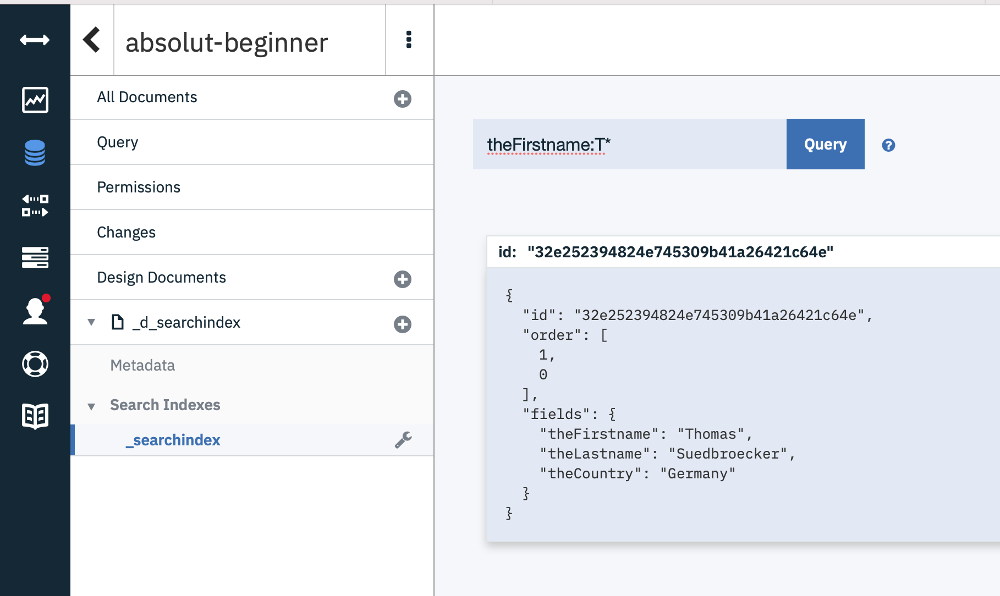
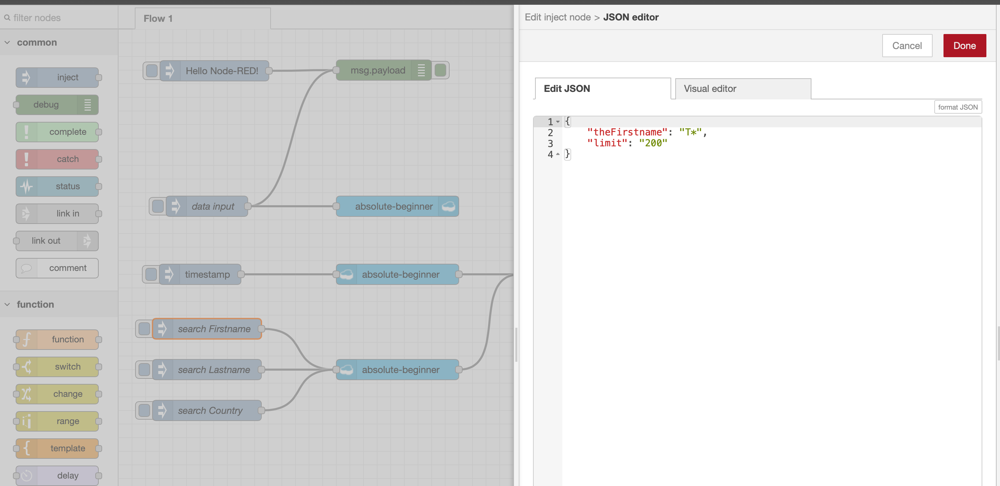
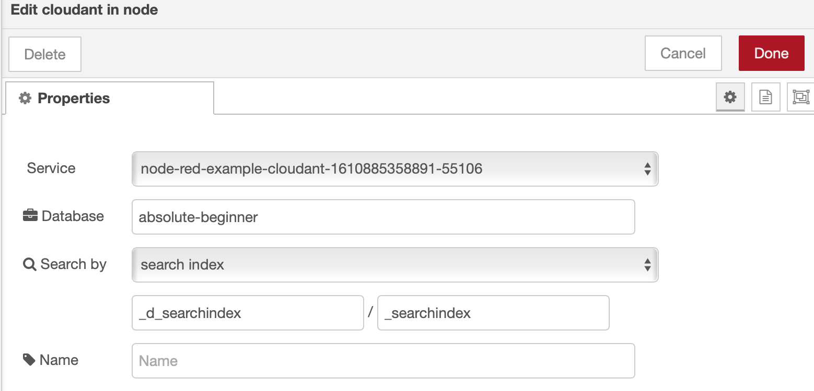

# Search for the entries

To search for data entries in our Cloudant database, we need to create a design document to define a [search index](https://cloud.ibm.com/docs/Cloudant?topic=Cloudant-query), that search index we will use later in our queries. Then we will create five additional nodes in our flow. 

* Three `inject`
* Two `cloudant in`
* One `debug`

The image shows the five wired nodes.



_Note:_ We need to ensure that we saved the data in the database in the right JSON format, when we going to use our queries.

```json
{ "user": {
    "firstname": "Thomas",
    "lastname": "Suedbroecker",
    "country": "Germany"
  }
}
```

## Configure a search index

We need to create a design document to define a [search index](https://cloud.ibm.com/docs/Cloudant?topic=Cloudant-query), that we will use later in our queries.

Here are the parameters for our queries:

* theFirstname
* theLastname
* theCountry

Example usage of a query `theLastname:S*`:



### Step 1: Open the Cloudant the created database `absolute-beginner`



### Step 2: Create a new design document just by press `Create document`


### Step 3: Insert following JSON to create the needed design document

```json
{
  "_id": "_design/_d_searchindex",
  "views": {},
  "language": "javascript",
  "indexes": {
      "_searchindex": {
        "analyzer": "standard",
        "index": "function (doc) {\n  index(\"default\", doc._id);\n\n  if(doc.user.firstname){\n    index(\"theFirstname\", doc.user.firstname, {\"store\": true, \"facet\":true});\n  }\n  if(doc.user.lastname){\n    index(\"theLastname\", doc.user.lastname, {\"store\": true, \"facet\":true });\n  }\n  if(doc.user.country){\n    index(\"theCountry\", doc.user.country, {\"store\": true, \"facet\":true});\n  }\n}"
    }
  }
}
```
The image shows the new design document. 



### Step 4: Open the search index `_searchindex` and insert in query "theFirstname:T*", then press query



### Step 5: Configure the three `inject nodes`

* Search for Firstname

```json
{
    "theFirstname": "T*",
    "limit": "200"
}
```

* Search for Lastname

```json

{
    "theLastname": "S*",
    "limit": "200"
}
```

* Search for Country

```json
{
    "theContry": "S*",
    "limit": "200"
}
```



### Step 6: Configure the new `cloudant in` node

* Database: `absolute-beginner`
* Search by: `search index`
* Design document: `_d_searchindex`
* Index name: `_searchindex`



### Step 7: Press `Deploy`
