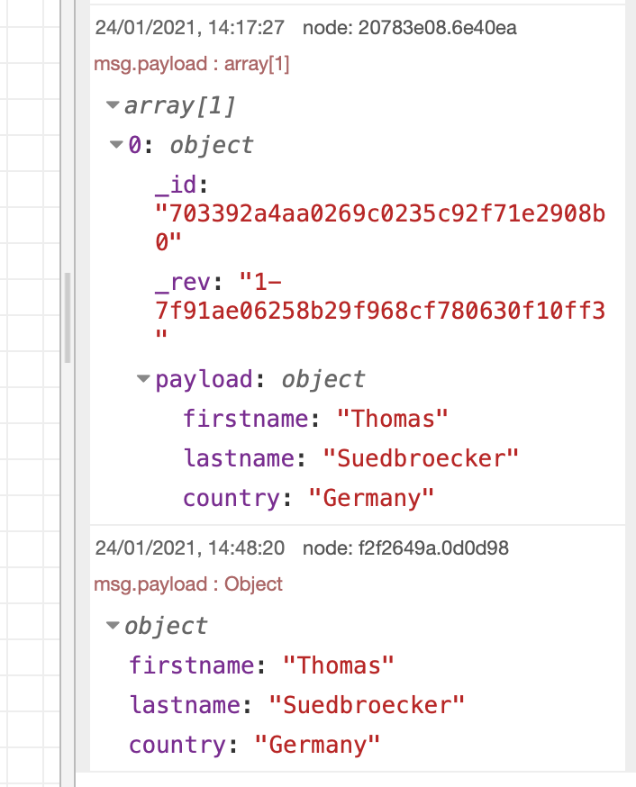

### Step 1: Open the `cloudant in` and verify you have selected 


### Step 2: Press the `inject node` `data input` once more and inspect the debug tab



### Step 3: Press the newly created inject node and watch the output in the debug tab

### Step 4: Open the cloudant database `absolute-beginner` and create a new design document

Insert following JSON as a new document:

```json
{
    "_id": "_design/_d_searchindex",
    "views": {},
    "language": "javascript",
    "indexes": {
      "_searchindex": {
        "analyzer": "standard",
        "index": "function (doc) {\n  index(\"default\", doc._id);\n\n  if(doc.user.firstname){\n    index(\"theFirstname\", doc.user.firstname, {\"store\": true, \"facet\":true});\n  }\n  if(doc.user.lastname){\n    index(\"theLastname\", doc.user.lastname, {\"store\": true, \"facet\":true });\n  }\n  if(doc.user.country){\n    index(\"theCountry\", doc.user.country, {\"store\": true, \"facet\":true});\n  }\n}"
      }
    }
}
```

### Step 5: Open the search index `_searchindex` and insert in query "theFirstname:T*", then press query


### Step 6: Add 3 `inject nodes` to the flow and a new `cloudant in`


