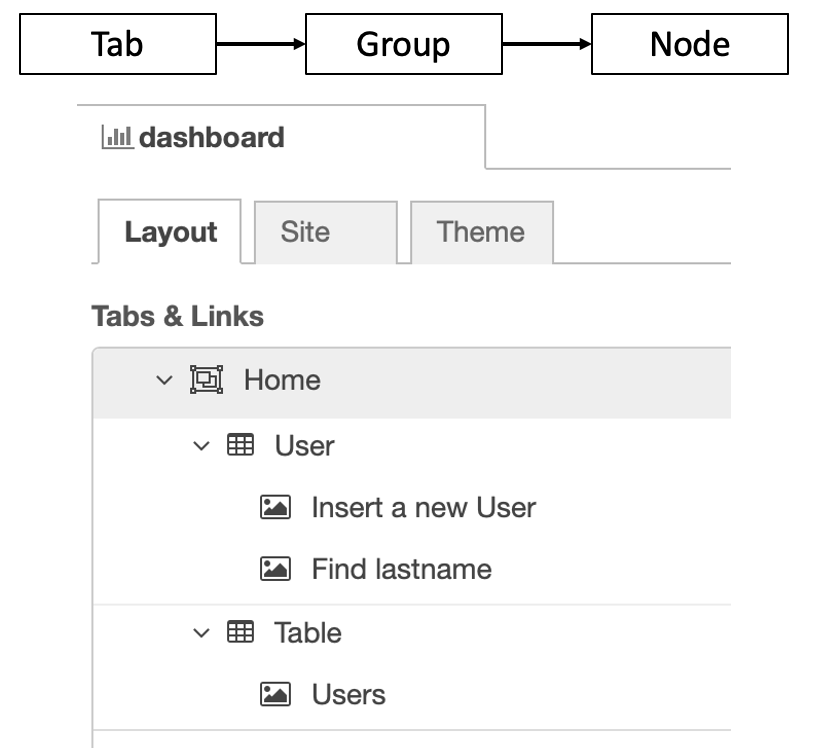
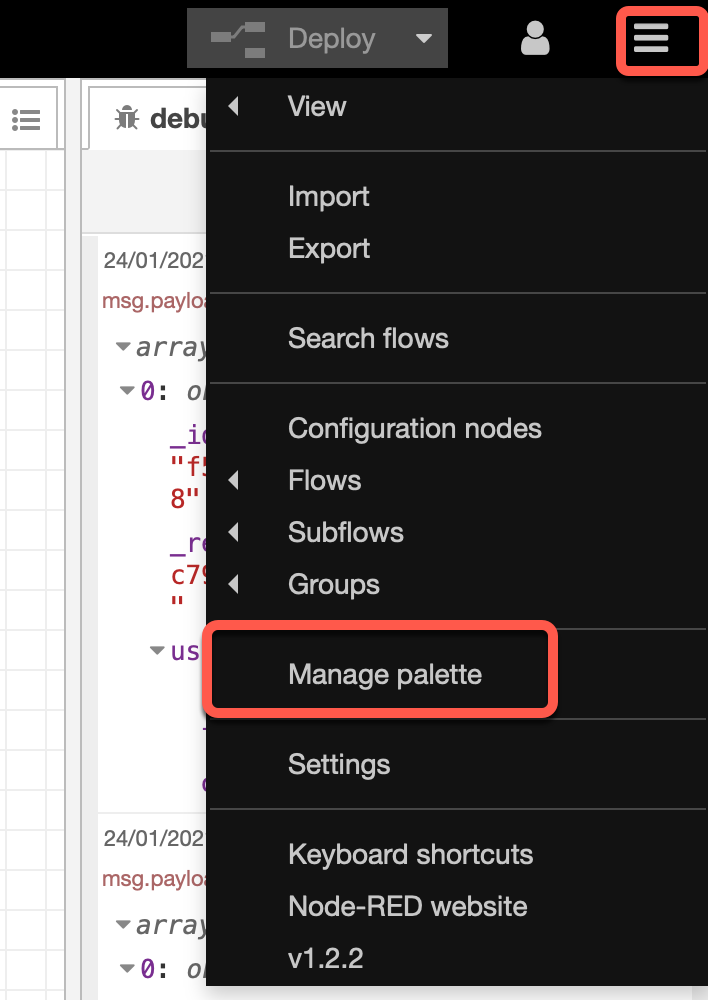
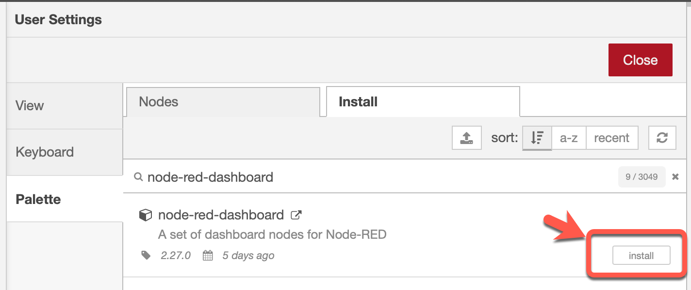
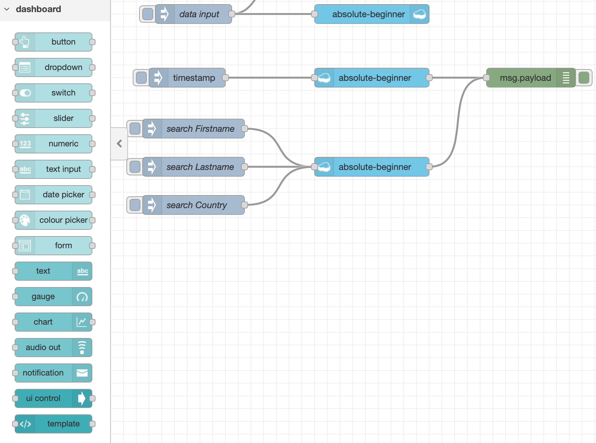
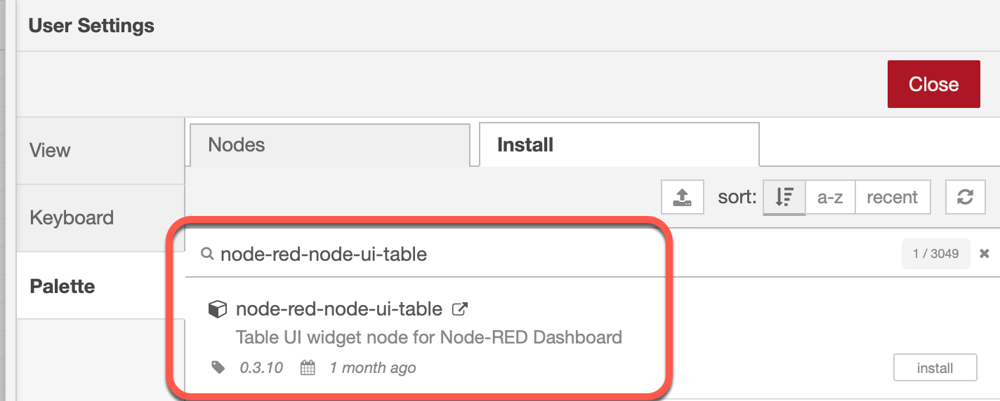
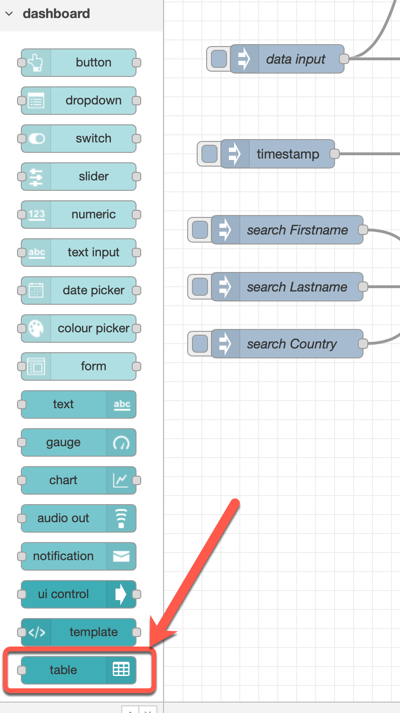

# Setup the UI 

To setup a UI in Node-RED we use the [Node-RED dashboard](https://flows.nodered.org/node/node-red-dashboard)
and [Node-RED UI Table](https://flows.nodered.org/node/node-red-node-ui-table).

The Node-RED dashboard uses `Tab`, `Group` and `Node element` structure and organized the UI Node elements. In the pricture below we see the dependencies.

### Step 1: Install the [Node-RED dashboard](https://flows.nodered.org/node/node-red-dashboard) and [Node-RED UI Table](https://flows.nodered.org/node/node-red-node-ui-table)

* Open `Manage palette`

* Select the `install` tab, insert `node-red-dashboard` and press install

* Insert `node-red-node-ui-table` and press install

