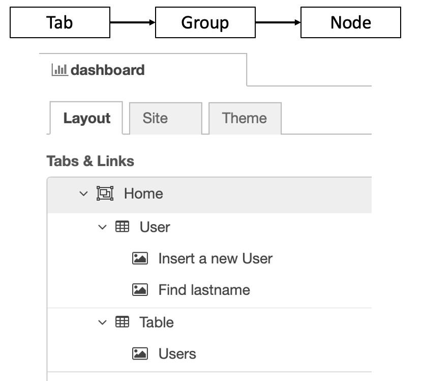

# Add a input `form` to the UI [(YouTube 12:10)](https://youtu.be/qtOmufIjafE?t=730%20%E2%80%8B)

The image contains the `form`, `function` and `debug`node, we will create.


### Step 1: Configure the UI input `form`


### Step 2: Configure the UI input `form`

Remember the structure of the UI elements.



* Add a group with the name `user`


* Add a tab with the name `Home` and press add


* Press add


* Give the UI from a name `Insert a new User` and add the input fields for firstname, lastname and country


* Add a `function` node and insert following code and wire the nodes

The code ensures that the data will be save in the right JSON format we need.

```javascript
var data = {};
data.user = msg.payload;
msg.payload = data;
return msg;
```


* Press `Deploy

### Step 7: Open in a new browser tab `https://[your-host]/ui/`


### Step 8: Insert a name and press `SUBMIT`


### Step 9: Now wire the function as input for the database


### Step 10:Press `Deploy`

