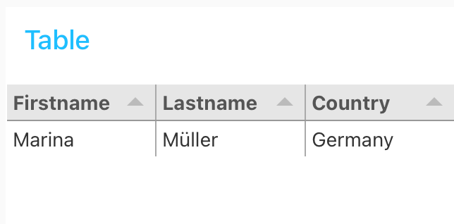

# Add  `table` to the UI [(YouTube 15:59)](https://youtu.be/qtOmufIjafE?t=959%20%E2%80%8B)

In this table we will display our data from the database.



### Step 1: Add UI `table` and `function` node to the flow


* Insert in the `function` node and insert following code

```javascript
if (msg.payload.errors !== undefined ){
    if (msg.payload.errors[0] !== undefined ){
        // do nothing
    }
} else {
    var userstemp  = [];
    userstemp = msg.payload;
    
    var users = [];
    count =  userstemp.length;
    
    var user = {};
    for (var i=0; i<count; i++){
        
       if( userstemp[i] !== undefined) {
         user.firstname = userstemp[i].user.firstname;
         user.lastname = userstemp[i].user.lastname;
         user.country = userstemp[i].user.country;
         users.push(user);
         user = {};
       } else {
           i = count;
       }
    }
    
    msg.payload = users;
}

return msg;
```

### Step 2: Configure the table UI

* Group: `Table`
* Properties: `firstname`, `lastname` and `country`.
* Titles: `Firstname`, `Lastname` and `Country`.


### Step 3: Press deploy
