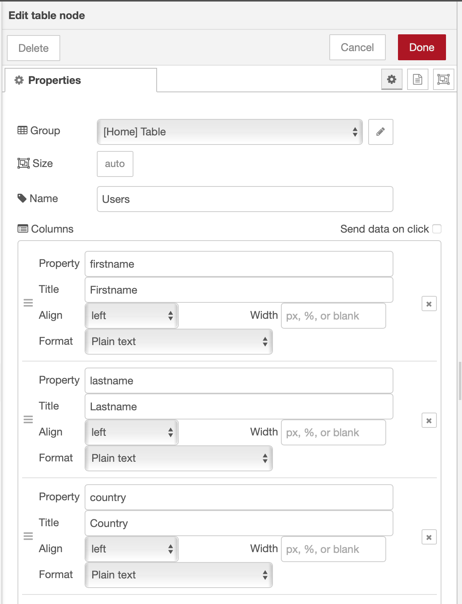

### Step 1: Add a UI table to the flow and function to the flow


* Insert in the function node and insert following code

```javascript
if (msg.payload.errors !== undefined ){
    if (msg.payload.errors[0] !== undefined ){
        // do nothing
    }
} else {
    var userstemp  = [];
    userstemp = msg.payload;
    
    var users = [];
    count =  userstemp.length;
    
    var user = {};
    for (var i=0; i<count; i++){
        
       if( userstemp[i] !== undefined) {
         user.firstname = userstemp[i].user.firstname;
         user.lastname = userstemp[i].user.lastname;
         user.country = userstemp[i].user.country;
         users.push(user);
         user = {};
       } else {
           i = count;
       }
    }
    
    msg.payload = users;
}

return msg;
```

### Step 2: Configure the table UI



### Step 3: Press deploy
