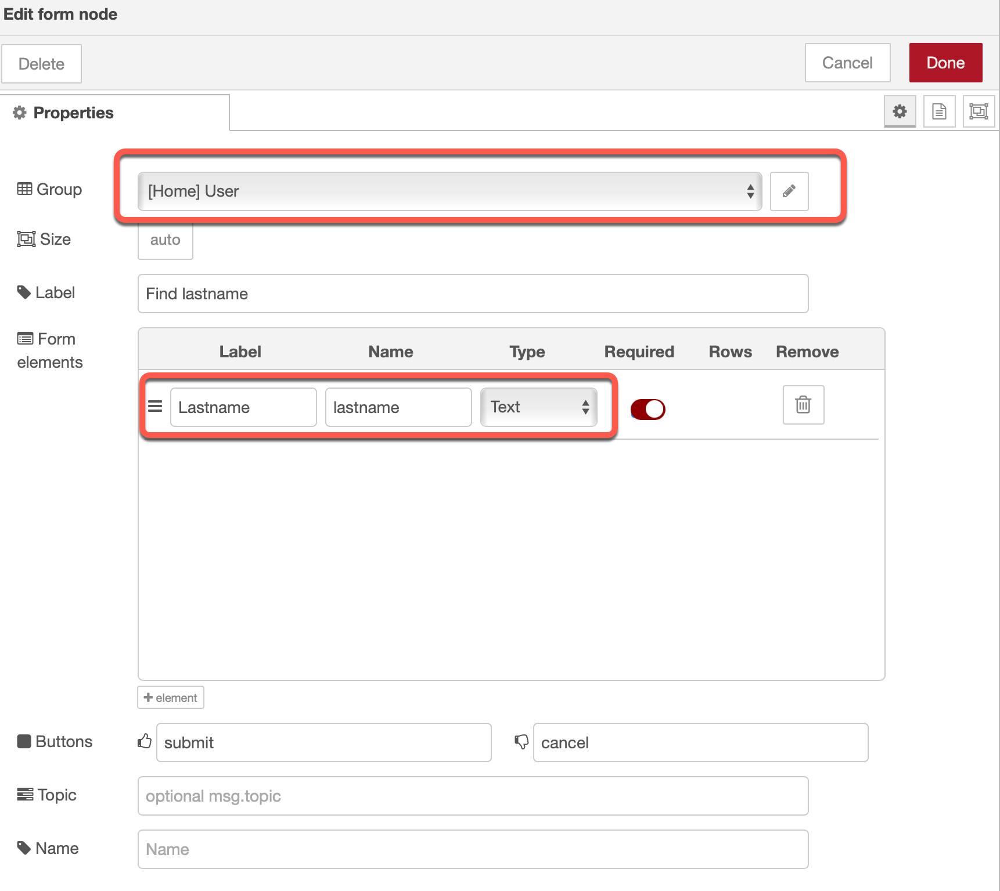

# Add a examle search to the UI [(YouTube 18:43)](https://youtu.be/qtOmufIjafE?t=1123)

Here we will enter search string for our lastname.


### Step 1: Add a UI `form` and `function` Node to the flow


* Insert in the function node and insert following code

```javascript
var data = {};
data.theLastname = msg.payload.lastname;
data.limit = "200";
msg.payload = data;
return msg;
```

### Step 2: Configure the UI `form` 

* Group: `User`
* Label: `Lastname`
* Name: `lastname`



### Step 3: Press deploy
