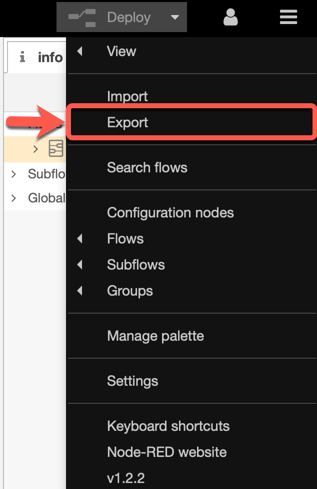
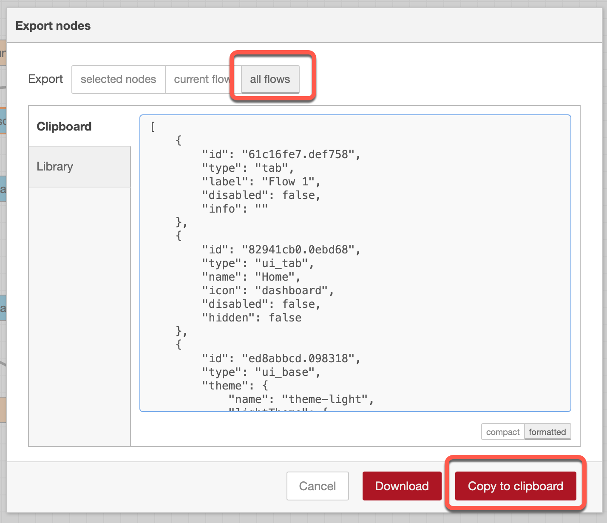

# Export the flow

Here is a simple way to export your flow.

### Step 1: Select from the burger menu `export`

### Step 2: Select `all flows`, `formated` and `Copy to clipboard`

### Step 3: Now you able to save the content in a file or just reuse it in a other Node-RED instance.
