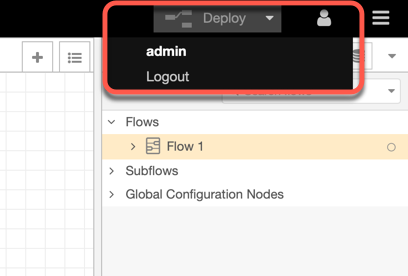
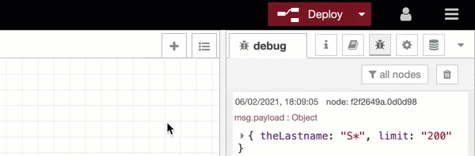
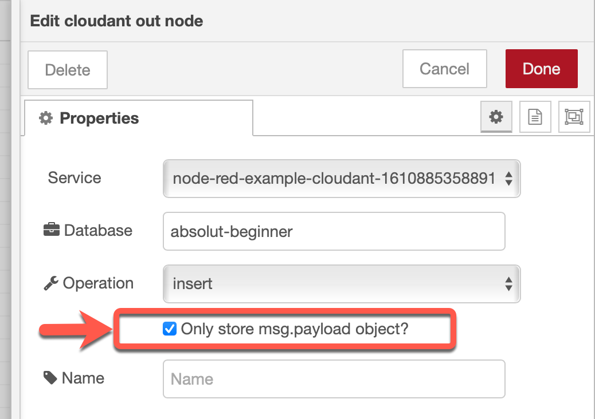

# Tips

In case something doesn’t work as it should, check out following tips.

### Tip 01:	Ensure you're logged on to your Node-RED flow

### Tip 02:	Ensure you have wired your node output to a debug node and watch the output

### Tip 03:	Ensure you have deployed your changes to the flow

### Tip 04:	When you imported the Node-RED flow ...

* Ensure you configured the `search index` for the `absolute-beginner` database
* Ensure you selected 
    

### Tip 05:	Get an overview of your UI structure

### Tip 06: If you can't install the dashboard

> If you can't install the [Node-RED dashboard](https://flows.nodered.org/node/node-red-dashboard) and [Node-RED UI Table](https://flows.nodered.org/node/node-red-node-ui-table). It's mostly related to that your Node-RED version is outdated or related packages are outdated. The easiest way is to uninstall the Node-RED App and setup Node-RED App again. Understand the dependencies of the Node-RED App setup in IBM Cloud by reading this [blog post](https://suedbroecker.net/2020/03/09/a-short-introduction-of-the-node-red-starter-kit-on-ibm-cloud-for-hackathons/).

The [new in 2021 setup](https://youtu.be/Iw20GhpOGOI) on IBM Cloud with the Tekton toolchain for the starter kit, you should follow this seqence to fully delete the Node-RED app. 

> Only if have running only the Node-RED app in your IBM Cloud instance.  

1. The 3 GitHub projects (just to save your not needed storage)
2. The Toolchain
3. The Cloudant alias
4. The Cloudant service (don't delete, if you using this service also in other applications)
5. The Continuous Delivery service (don't delete, if you using this service also in other toolchains)
6. The Cloud Foundry app (don't forget to delete the routes you used)

